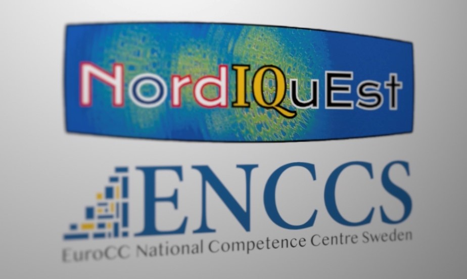

# Introduction to Quantum Computing Hybrid HPC-QC Systems

## Table of Contents
1. [Description](#description)
2. [Information](#information)
3. [Installation](#installation)
4. [Certificate](#certificate)

## Description

Recent developments in quantum technology are bringing the world closer to a new technological revolution – the advent of usable quantum computers able to provide enormous acceleration to important computational tasks. In coming years, quantum computing is expected to have a huge impact on practically all areas of research that can utilise computational modelling.

The NordΙQuEst project brings together a consortium of seven partners from five Nordic and Baltic countries to connect world-leading traditional HPC resources and quantum computers across national borders with the aim to establish a quantum computing platform customised to the needs of the region.

ENCCS joined forces with NordIQuEst to deliver two-day training workshops covering the fundamentals of quantum computing (QC), including:
> - Introduction to key concepts: quantum states, qubits, quantum algorithms;
> - QC programming in high-level languages for use cases in optimisation, finance and quantum chemistry followed by testing quantum programs to esure their correctness;
> - Overview of the main QC hardware approaches;
> - Integration of QC with classical computing: hybrid classical/quantum algorithms and HPC-QC systems;
> - Introduction to quantum software testing with Quito tool;

## Information

All necessary information, links and materials for the workshop can be found [here](https://hackmd.io/@enccs/qcomp-june2022).

Workshop moment 1          |  Workshop moment 2
:-------------------------:|:-------------------------:
  |  

## Installation

Detailed instructions for setting up the software environment required can be found [here](https://enccs.github.io/NordIQuEst-workshop/setup/).

## Certificate
The certificate can be found [here](https://github.com/HROlive/Introduction-to-Quantum-Computing-Hybrid-HPC-QC-Systems/blob/main/images/certificate-hugo-oliveira.pdf).
